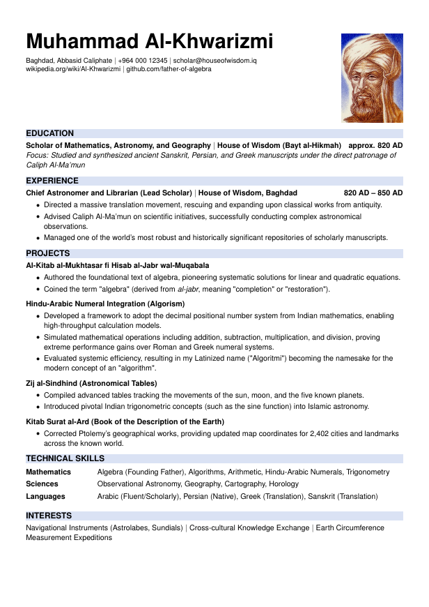
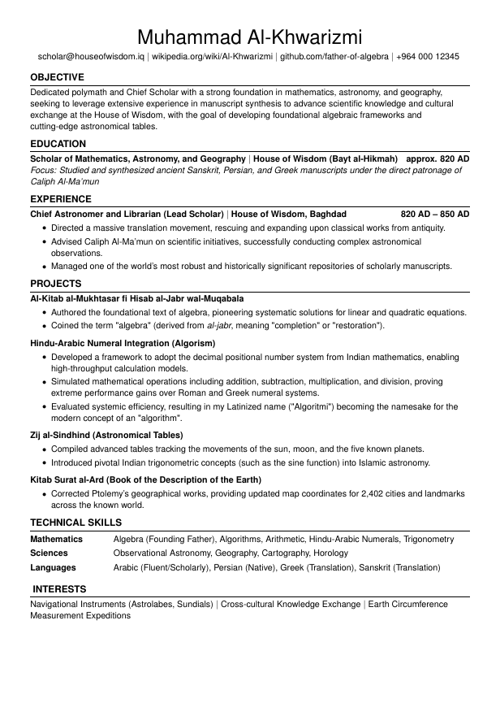

# Modular LaTeX Resume Template

This repository contains a clean, professional, and ATS-friendly LaTeX resume template. It is designed with a modular file structure to separate formatting from content, making it incredibly easy to update and maintain.

## 📄 Included Templates
This project includes two distinct resume layouts to suit different application requirements:

* **Modern (`Resume_modern.tex`):** A contemporary layout featuring a side-by-side header with a profile photo.
* **Classic (`Resume_classic.tex`):** A traditional, highly streamlined layout without a profile photo, ideal for standard corporate applications or regions with strict anti-bias photo regulations.

## 📋 Preview

| Modern Format (with photo) | Classic Format (no photo) |
| :---: | :---: |
|  |  |


## ✨ Key Features

* **ATS-Friendly:** Includes `glyphtounicode` mapping to ensure Applicant Tracking Systems can parse the PDF text accurately.
* **Modular Content:** All textual content (Education, Experience, Projects, Skills, Interests) is stored in separate `.tex` files within the `Sections/` directory.
* **Customizable Colors:** Easily change the section header highlight color via a single RGB variable.
* **Compact Formatting:** Custom list environments tighten spacing to maximize the information you can fit on a single page.


## 🚀 How to Use

### 1. Update Your Content
Navigate to the `Sections/` folder and edit the individual `.tex` files with your personal information. Because the template is modular, any changes made here will automatically reflect in both the Modern and Classic resume formats.

### 2. Update the Header & Photo
Open either `Resume_modern.tex` or `Resume_classic.tex` and locate the `--- HEADER SECTION ---`. 
* Update the name, phone number, email, and social links.
* **For the Modern format:** Ensure your profile photo is saved in the root directory and update the filename in the `\includegraphics{}` command.

### 3. Compile the PDF
You can compile this project using any standard LaTeX distribution (like TeX Live or MiKTeX) or via a cloud editor like [Overleaf](https://www.overleaf.com/). 

**Recommended Compiler:** `pdflatex` 

If compiling locally via terminal:
```bash
pdflatex Resume_modern.tex
# or
pdflatex Resume_classic.tex
```

## 🎨 Customization Guide

* **Changing the Theme Color:** Open your main `.tex` file and locate the `\definecolor{cvsectioncolor}` command. Replace the RGB values `(218, 226, 244)` with your preferred color.
* **Adjusting Margins:** The document uses the `geometry` package. You can adjust the `top`, `bottom`, `left`, and `right` margins in the `\usepackage[...]{geometry}` configuration at the top of the main files.
* **Bullet Point Spacing:** If you need to fit more text, adjust the `itemsep`, `leftmargin`, and `topsep` values in the `\setlist[itemize]` configuration.
